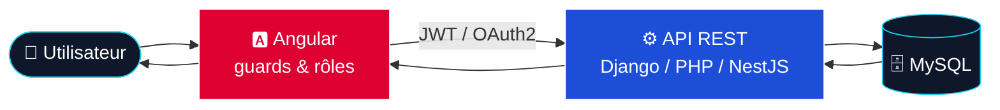

<!-- ============================================================
  ⚠️ Remplace TON-PSEUDO par ton pseudo GitHub (Ctrl+F → Remplacer tout)
============================================================ -->

<div align="center">

<!-- 🌊 BANNIÈRE ANIMÉE : nom + fond dégradé -->


<!-- ⌨️ TEXTE QUI SE TAPE TOUT SEUL -->
<a href="https://github.com/TON-PSEUDO">
  
</a>

<br/><br/>


<br/><br/>
</div>

<br/>

---

## 🧑‍💻 `whoami`

```ts
const arthur = {
  nom: "Arthur D",
  école: "HELHa",
  formation: "Développement d'application",
  focus: ["Applications web", "UI mobile-first", "Sécurité des API"],
  stack: {
    frontend: ["Angular", "HTML", "CSS", "Sass", "JavaScript"],
    backend: ["Python / Django", "PHP", "API REST"],
    données: ["MySQL"],
    sécurité: ["JWT", "OAuth2 Google", "Rôles d'accès"],
  },
  motivation: "Apprendre vite, construire propre, résoudre de vrais problèmes",
  statut: "En train de coder ☕",
};
```

---

<table width="100%">
<tr>

<!-- COLONNE GAUCHE -->
<td valign="top" width="50%">

## 🎯 Ce que je fais

- 🖥 **Apps Frontend** : Angular (standalone, guards, gestion de rôles)
- 🔐 **Sécurité** : authentification, contrôle d'accès, protection des API
- 📊 **Dashboards & panels** : interfaces pensées pour la donnée
- ⚙️ **Backend & BDD** : APIs REST, bases MySQL

## 🌱 Mon approche

- 📱 Design **mobile-first** et responsive
- 🧼 Code **propre et structuré**
- 🎨 Du **design d'interface (UI)** jusqu'à l'optimisation back-end
- 🧪 Projets scolaires, perso et expérimentations en tout genre

</td>

<!-- COLONNE DROITE -->
<td valign="top" width="50%" align="center">

## 🛠 Stack technique

**Frontend**<br/>
<br/><br/>

**Backend**<br/>
<br/><br/>

**Données & sécurité**<br/>


<br/><br/>

**Outils**<br/>


</td>
</tr>
</table>

---

## 🧩 Comment mes apps fonctionnent



---

## 📈 Stats GitHub

<div align="center">


<br/>


<div>

---

## 📫 On reste en contact

<div align="center">

<a href="https://github.com/arthurcodeh"></a>


<br/><br/>

<sub>💬 Ouvert aux collabs, aux stages et aux idées de projets !</sub>

</div>

<!-- 🌊 PIED DE PAGE -->

